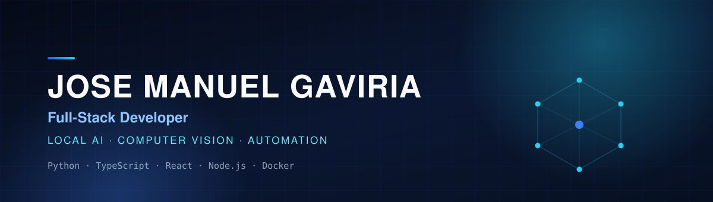
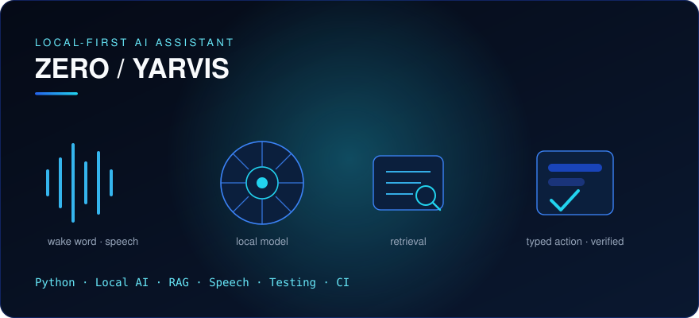
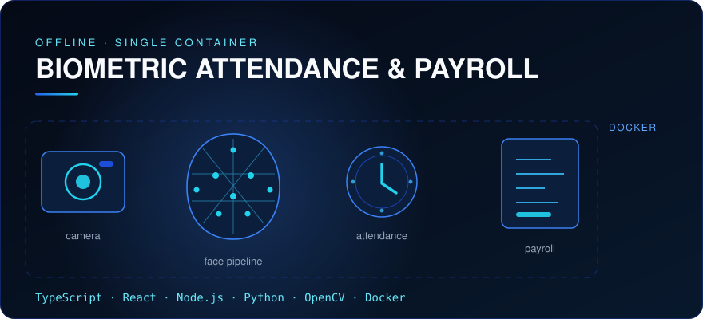

  

### Full-Stack Developer · Local AI · Computer Vision · Automation

`Python` &nbsp;·&nbsp; `TypeScript` &nbsp;·&nbsp; `React` &nbsp;·&nbsp; `Node.js` &nbsp;·&nbsp; `Docker`

I build complete systems that connect software, automation and applied AI 
to real operational problems.

**[ View projects ](#main-projects)** &nbsp;&nbsp; **[ GitHub ](https://github.com/jose-gaviria?tab=repositories)** &nbsp;&nbsp; **[ Contact ](#contact)**

[Projects](#main-projects) · [Stack](#what-i-do) · [Experience](#experience--education) · [Contact](#contact)

 

## Main projects

 

### ZERO / YARVIS

**Local-first AI desktop assistant.** Wake-word detection, speech recognition, local LLM inference,
retrieval, typed desktop actions and verification — running on the machine that owns the data.

`Python` · `Local AI` · `RAG` · `Speech` · `Testing` · `CI`

**315 tests passing · GitHub Actions verified**

**[View project →](https://github.com/jose-gaviria/zero-yarvis)**

Architecture &amp; engineering

 

- Typed tool contracts: every desktop action is declared, validated and executed through one path.
- Execution journal and verification predicates — an action is only reported as done once its effect is checked.
- Voice pipeline: wake word, speech-to-text, local model inference, speech synthesis.
- Retrieval over a local index, so answers stay grounded in the user's own documents.
- Verified in CI on every push, with the full test suite.

 

### Biometric Attendance &amp; Payroll

**Offline facial attendance and Colombian payroll system.** Workers clock in by looking at a camera;
shifts become a payroll settlement under Colombian labour rules. One Docker container, no cloud.

`TypeScript` · `React` · `Node.js` · `Python` · `OpenCV` · `Docker`

**Face recognition · Attendance · Payroll · Offline deployment · CI**

**[View project →](https://github.com/jose-gaviria/biometric-attendance-payroll)**

Architecture &amp; engineering

 

- Three supervised processes in one image: two Express services and a Python vision engine.
- Two SQLite databases with distinct owners — biometric profiles apart from workers and shifts.
- Detection, quality validation, landmarks, embeddings and cosine matching with threshold and margin.
- No face image is stored; embeddings never reach the browser.
- Non-root, read-only container; model weights provisioned from pinned sources and verified by SHA-256.
- CI runs the Node suites and the Python face-engine suite against the real models.

Stated limits

 

- Identification does not implement certified liveness or anti-spoofing; the active challenge exists only at enrolment.
- Biometric accuracy is not claimed — the tests verify behaviour, not population accuracy.
- Payroll parameters are tied to a documented reference period and expire when the law changes.

 

## More work

<table>
  <tr>
    <td width="50%" valign="top">
      <h4>Parking Management Platform</h4>
      
Parking operations end to end: tickets, tariffs, payments, shifts and audit trails.

      
<code>Next.js</code> <code>NestJS</code> <code>Prisma</code> <code>PostgreSQL</code>

      
<a href="https://github.com/jose-gaviria/parking-management-platform">View →</a>

    </td>
    <td width="50%" valign="top">
      <h4>Heikamfy Sport</h4>
      
Sports ecommerce with headless catalogue, payments and order integration.

      
<code>Next.js</code> <code>TypeScript</code> <code>Shopify</code> <code>Mercado Pago</code>

      
<a href="https://github.com/jose-gaviria/heikamfy-sport">View →</a>

    </td>
  </tr>
  <tr>
    <td width="50%" valign="top">
      <h4>Llanogrande Visitor Control</h4>
      
Visitor access and warehouse control with roles, QR identification and traceability.

      
<code>Next.js</code> <code>TypeScript</code> <code>Supabase</code>

      
<a href="https://github.com/jose-gaviria/llanogrande-visitor-control">View →</a>

    </td>
    <td width="50%" valign="top">
      <h4>Emaus WhatsApp Commerce</h4>
      
WhatsApp commerce operations with automation, analytics and containerized services.

      
<code>Node.js</code> <code>PostgreSQL</code> <code>Docker</code> <code>WhatsApp Cloud API</code>

      
<a href="https://github.com/jose-gaviria/emaus-whatsapp-commerce">View →</a>

    </td>
  </tr>
</table>

 

## What I do

<table>
  <tr>
    <td width="50%" valign="top">
      <h4>Full stack</h4>
      
React · Next.js · Node.js · APIs · Databases

    </td>
    <td width="50%" valign="top">
      <h4>Python &amp; applied AI</h4>
      
Python · Local AI · RAG · Speech · FastAPI

    </td>
  </tr>
  <tr>
    <td width="50%" valign="top">
      <h4>Computer vision</h4>
      
OpenCV · MediaPipe · Face recognition

    </td>
    <td width="50%" valign="top">
      <h4>Systems &amp; automation</h4>
      
Docker · CI/CD · n8n · Git · Automation

    </td>
  </tr>
</table>

  

 

## Engineering proof

- **ZERO / YARVIS — 315 tests passing**, verified by GitHub Actions.
- **Biometric system — Node and Python suites verified in CI**, including the face engine against the real models.
- **Dockerized offline deployment validated**: three services recovered after restart, data preserved, no external network.
- **Model weights provisioned by SHA-256** against a manifest, not vendored into the repository.

 

## Experience &amp; education

**Agencia Dinamo** — Programmer &amp; IT Support Assistant · Jan 2025–Present

Responsibilities

 

- Build and refine web, automation and internal operational solutions.
- Automate repetitive workflows with n8n and connected services.
- Test, document and support software used by internal teams.
- Troubleshoot Windows environments, software and day-to-day IT requirements.

**Politécnico ASDI** — Computer Systems Technical Diploma · In progress

 

## Contact

**Interested in building software, automation or applied AI systems?**

[josegaviria1515@gmail.com](mailto:josegaviria1515@gmail.com) &nbsp;·&nbsp; [github.com/jose-gaviria](https://github.com/jose-gaviria)

El Retiro, Antioquia, Colombia

