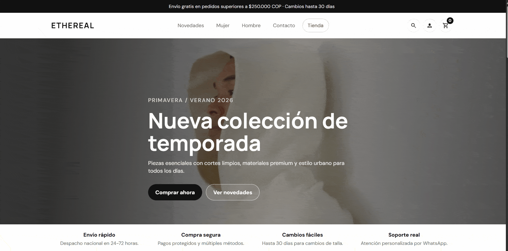

  

  
  
  

  <h3>Building useful software, clean web solutions, and workflow automations with real business value.</h3>

  I’m a <b>4th-semester Computer Systems student</b> at <b>Politécnico ASDI</b>, currently working at
  <b>Agencia Dinamo</b> as <b>Programmer & IT Support Assistant</b>.
  My focus is on <b>web development</b>, <b>automation with n8n</b>, and continuous growth toward
  <b>software</b>, <b>web</b>, and <b>mobile development</b>.

<table>
  <tr>
    <td width="50%" valign="top">
      <h2>💡 About Me</h2>
      <ul>
        <li>Experience building internal web and automation solutions for business needs.</li>
        <li>Solid foundation in HTML, CSS, JavaScript, PHP and SQL.</li>
        <li>Hands-on work testing, refining and documenting internal tools.</li>
        <li>Growing toward mobile development with Flutter and Kotlin.</li>
        <li>Interested in junior opportunities where I can build, learn and contribute fast.</li>
      </ul>
    </td>
    <td width="50%" valign="top">
      <h2>🎯 Current Focus</h2>
      <ul>
        <li>Responsive and functional web interfaces.</li>
        <li>Workflow automation with n8n.</li>
        <li>Learning React, Node.js, Docker and Flutter.</li>
        <li>Improving problem-solving, support and software delivery skills.</li>
        <li>Creating portfolio projects with clear business impact.</li>
      </ul>
    </td>
  </tr>
</table>

<h2 align="center">🛠️ Tech Stack</h2>

  
    
  
  
  

<h2 align="center">🚀 What I Bring</h2>

<table>
  <tr>
    <td width="33%" valign="top">
      <h3>🌐 Web Development</h3>
      

        I build responsive interfaces and practical internal solutions using
        HTML, CSS, JavaScript, PHP and SQL.
      

    </td>
    <td width="33%" valign="top">
      <h3>🤖 Automation</h3>
      

        I automate repetitive workflows with n8n to reduce manual work and improve operational efficiency.
      

    </td>
    <td width="33%" valign="top">
      <h3>🛠️ Support & Execution</h3>
      

        I can test, document, troubleshoot and support software and Windows environments with a practical mindset.
      

    </td>
  </tr>
</table>

<h2>💼 Experience</h2>

  
<b>Agencia Dinamo | Programmer & IT Support Assistant | 2024 - Present</b>

   
  <ul>
    <li>Automating internal processes with n8n to optimize operational tasks.</li>
    <li>Developing and adjusting basic solutions aligned with internal business needs.</li>
    <li>Testing, improving and documenting web and automation tools.</li>
    <li>Providing technical support for Windows environments, software and internal requirements.</li>
  </ul>

  
<b>Previous Professional Background</b>

   
  

    Before moving deeper into technology, I worked in production-focused environments where I strengthened
    planning, quality standards, autonomy and disciplined execution — skills I now bring into software development.
  

  
<b>🎓 Education & Learning</b>

   
  <ul>
    <li><b>Politécnico ASDI</b> — Technical Diploma in Computer Systems <i>(in progress, 4th semester)</i></li>
    <li><b>I.E. Ignacio Botero Vallejo</b> — High School Diploma</li>
    <li><b>Currently learning:</b> React, Node.js, Docker and Flutter</li>
    <li><b>Other knowledge:</b> Python, Kotlin, Windows, hardware/software diagnostics and networking basics</li>
  </ul>

<h2>🧩 Featured Projects</h2>

  This section is intentionally ready for your best work. Replace each placeholder with a real project focused on
  impact, stack and measurable results.

<!--
Ejemplo de captura local para un proyecto:

-->

<table>
  <tr>
 <td width="33%" valign="top" align="center">

  

    

  <b>Ethereal Store Frontend</b>
   

  
    Front-end de tienda de ropa ficticia inspirada en marcas reales.
  

    

  

    

  

</td>
    <td width="33%" valign="top">
      <h3>Project 02 — n8n Automation</h3>
      
<b>Stack:</b> n8n, Webhooks, APIs

      

        Describe the workflow, what it automated, and how much time or manual effort it reduced.
      

      

        <a href="https://ligaantioquena.kesug.com/?i=1">🔗 Repository</a> |
        <a href="#">📄 Case Study</a>
      

    </td>
    <td width="33%" valign="top">
      <h3>Project 03 — Mobile App</h3>
      
<b>Stack:</b> Flutter, Dart, API / Firebase

      

        Use this space for your best mobile project, MVP or learning build with clear features and purpose.
      

      

        <a href="#">🔗 Repository</a> |
        <a href="#">🎥 Demo</a>
      

    </td>
  </tr>
</table>

<h2>🤝 Contact</h2>

  

<!--
Descomenta y reemplaza cuando tengas tus enlaces reales:

  
  

-->

<!--
Sección opcional de estadísticas.
Actívala cuando ya tengas suficientes repositorios y actividad para que juegue a tu favor.

<h2 align="center">📊 GitHub Stats</h2>

  
  

-->

  <h3>Thanks for visiting my profile 👋</h3>
  

    I’m open to junior opportunities where I can contribute, keep learning, and build software that solves real problems.
  

  

